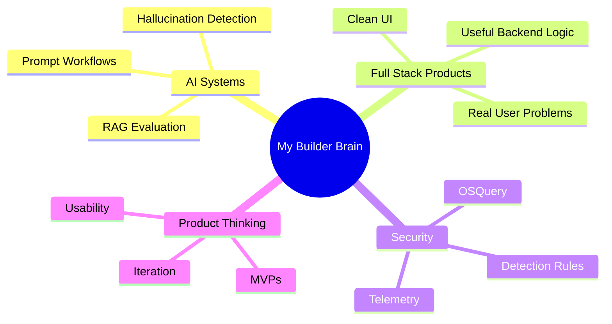

<!-- ===== HERO BANNER ===== -->
<p align="center">
  
</p>

<!-- ===== TYPING ANIMATION ===== -->
<p align="center">
  
</p>

<!-- ===== SOCIALS ===== -->
<p align="center">
  <a href="https://linkedin.com/in/ishitaajain1">
    
  </a>
  <a href="mailto:jainid@mail.uc.edu">
    
  </a>
  <a href="https://portfolio-ishitaa-jain.vercel.app/">
    
  </a>
</p>

---

## 👋 About Me

```yaml
name: Ishitaa Jain
role: AI + Full-Stack Developer
school: University of Cincinnati
location: Cincinnati, OH
focus: Building practical systems with real-world impact
```

I’m a Computer Science student who enjoys building practical, polished systems that solve real problems.  
I’m especially interested in AI-powered products, reliable retrieval systems, and full-stack architecture.

---

## 🚀 Featured Work

<table>
<tr>
<td width="50%">

### 🍽️ PrepPAL  
AI-powered meal planning system  

**Stack:** React, TypeScript, Supabase, Postgres, Claude API  

</td>
<td width="50%">

### 🧠 Adaptive RAG Reliability  
Research on hallucination + grounding  

**Focus:** RAG, Evaluation, EM/F1, Python  

</td>
</tr>

<tr>
<td width="50%">

### 🤝 UC DoubtClear  
AI-powered Q&A platform built collaboratively  

**Highlights:**  
• JWT authentication  
• AI-generated answers  
• Leaderboard + user system  

**Stack:** React, FastAPI, PostgreSQL  

<a href="https://github.com/SamarthP7704/uc_doubtclear">View Repository →</a>

</td>
<td width="50%">

### 🛡️ Cybersecurity Research  
Endpoint detection + validation  

**Focus:** OSQuery, MITRE ATT&CK  

</td>
</tr>
</table>

---

## ✨ Interactive Highlights

<table>
<tr>
<td width="33%" align="center">

### 🧠 AI Research
RAG reliability, hallucination detection, grounding, and evaluation pipelines.


</td>
<td width="33%" align="center">

### 🍽️ Product Building
Designing useful AI-powered tools like PrepPAL for real-world daily problems.


</td>
<td width="33%" align="center">

### 🛡️ Security Mindset
Endpoint detection, telemetry validation, OSQuery, and MITRE ATT&CK mapping.


</td>
</tr>
</table>

---

## 🧪 What I Like Building



---

## 🧬 My Build Style

```txt
idea → rough prototype → break it → fix it → polish it → learn from it
```

<p align="center">
  
  
  
</p>

---

## 🛠 Tech Stack

<p align="center">
  <b>Languages</b>
</p>

<p align="center">
  
</p>

<p align="center">
  <b>Frontend</b>
</p>

<p align="center">
  
</p>

<p align="center">
  <b>Backend & Databases</b>
</p>

<p align="center">
  
</p>

<p align="center">
  <b>Cloud, DevOps & Tools</b>
</p>

<p align="center">
  
</p>

<p align="center">
  
  
  
  
</p>

---

## 📊 GitHub Analytics

<p align="center">
  
</p>

<p align="center">
  
  
</p>

---

## 📈 Contribution Activity

<p align="center">
  
</p>

---

## 🐍 Contribution Snake

<p align="center">
  
</p>

---

## 🌱 Currently Learning

```diff
+ Designing reliable AI systems
+ Building scalable backend workflows
+ Improving RAG evaluation pipelines
+ Shipping polished full-stack products
```

---

## ✨ A Little More About Me

I like products that feel useful, not just impressive.  
I care about clean UI, strong backend logic, and systems that actually work.  
My favorite projects are the ones where AI actually improves the product experience.

---

<p align="center">
  <b>Building, learning, and improving every day.</b>
</p>

<!-- ===== FOOTER ===== -->
<p align="center">
  
</p>
